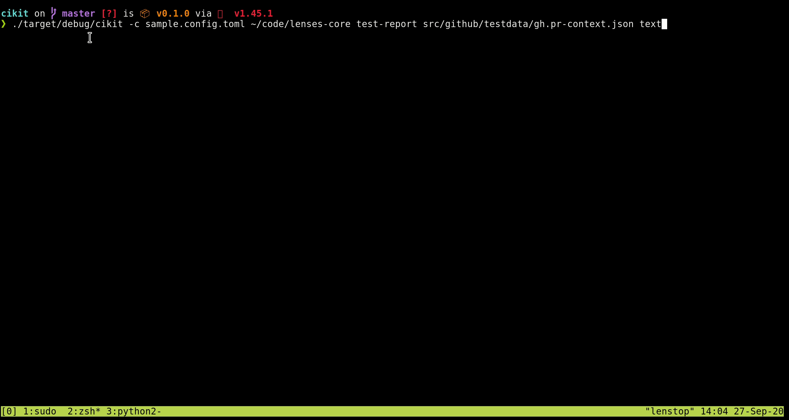

## CI Kit

Playground project using Rust to build a minimum viable CI reporting tool.

### Goals

- Provide a minimal but functional UI to display JUnit test reports both through the CLI and as an HTML document.
- Notify test outcome through various channels: i.e. slack web-hooks, github comments/annotations, email, etc.
- Have fun!

### Development status

🚧 This is a work in progress and is not feature complete yet!

A rudimentary React-based HTML viewer is already implemented:


_Note:_ in order to view the generated reports, you will need to run a webserver using the `report` folder as the document root (e.g `cd report && python2 -m SimpleHTTPServer 8000`).

Also, reports can be rendered in the console using the even more crude _text_ format:



### Usage

```
cikit 0.1.0
The continuous integration reporting toolkit

USAGE:
    cikit --config-path <config-path> [project-dir] <SUBCOMMAND>

FLAGS:
    -h, --help       Prints help information
    -V, --version    Prints version information

OPTIONS:
    -c, --config-path <config-path>    Input file

ARGS:
    <project-dir>

SUBCOMMANDS:
    help           Prints this message or the help of the given subcommand(s)
    notify         Notifies the build outcome via Slack
    test-report    Reads the Junit test report
```

### Building and running

In order to statically embed a small set of web assets into its executable, `cikit`
wraps its UI build (React/TypeScript) into a Cargo build. 
Assuming you have both `npm` and `rustup` (default toolchain) installed, you should be able to build the project in one go by simply running:

`cargo build`

and then

`cargo test` to execute the test suite.

Finally, you can iteratively recompile and run the program by prefixing the normal executable call with `cargo run --`:

```bash
RUST_LOG='cikit=debug' RUST_BACKTRACE=1 cargo run -- \ 
   -c sample.config.toml ~/code/project-with-junit \ 
   test-report html -o test-report -f
```

You might want to amend the `report_dir_pattern` config value with a glob expression that matches your project junit XML report dir/s.